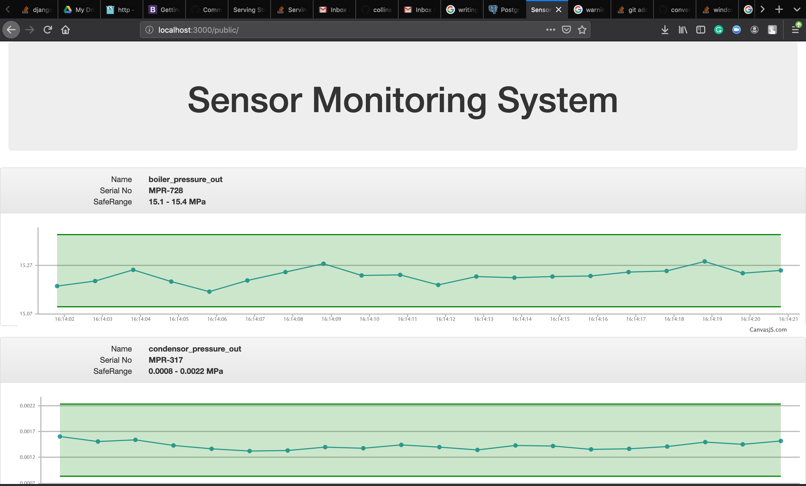

# Sensors Monitoring System

This project demonstrates monitoring sensors in a distributed system using Golang.
It serves as a demonstration of how the concepts of distributed architecture can be applied to a Go application. The sensors are simulated in this application.



## Running the application

Install go dependencies:
```bash
go get github.com/lib/pq
go get github.com/gorilla/websocket
go get github.com/streadway/amqp
```

Start the web application:

```bash
    go run src/distributed/web/main.go
```

Start simulated sensors:

```bash
bash start_sensors.sh
```

Start the coordinators:

```bash
bash start_coordinator.sh
```

## Credits
[Mike Van Sickle](https://app.pluralsight.com/library/courses/go-build-distributed-applications/description) 
